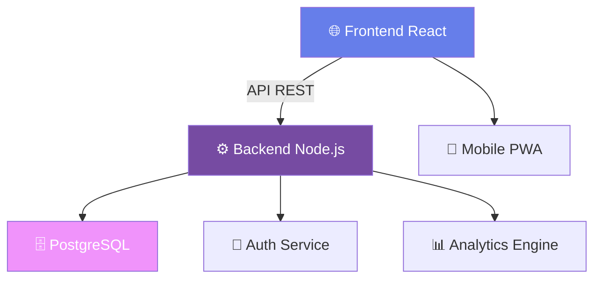
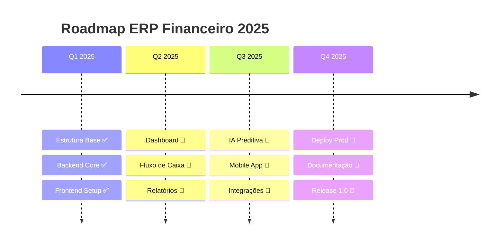

# <div align="center">💎 ERP FINANCEIRO</div>

<div align="center">
  
</div>

<div align="center">
  
  [](https://git.io/typing-svg)
  
</div>

<div align="center">
  <a href="#"></a>
  <a href="#"></a>
  <a href="#"></a>
  <a href="#"></a>
</div>

<br>

<div align="center">
  
</div>

---

##  **Sobre o Projeto**

<div style="background: linear-gradient(135deg, #667eea 0%, #764ba2 100%); padding: 20px; border-radius: 15px; margin: 20px 0;">

Sistema de **gestão financeira empresarial** desenvolvido como módulo principal de um ERP completo. Este projeto integrador simula um ambiente real de desenvolvimento corporativo, aplicando as mais modernas tecnologias e metodologias ágeis do mercado.

</div>

### ✨ **Destaques**

<table>
  <tr>
    <td align="center" width="33%">
      <br>
      <b>🎯 Dashboard Real-Time</b><br>
      <sub>Visualização instantânea de KPIs</sub>
    </td>
    <td align="center" width="33%">
      <br>
      <b>🔐 Segurança Máxima</b><br>
      <sub>Criptografia de ponta a ponta</sub>
    </td>
    <td align="center" width="33%">
      <br>
      <b>📊 Analytics Avançado</b><br>
      <sub>IA para previsões financeiras</sub>
    </td>
  </tr>
</table>

---

## 🛸 **Stack Tecnológica**

<div align="center">

|  |  |  |  |
|:---:|:---:|:---:|:---:|
| **React 18** | **Node.js** | **PostgreSQL** | **Docker** |
| Frontend | Backend | Database | Container |

|  |  |  |  |
|:---:|:---:|:---:|:---:|
| **Tailwind** | **Express** | **Jest** | **GitHub Actions** |
| Styling | API REST | Testing | CI/CD |

</div>

---

## 👥 **Dream Team**

<div align="center">

|  |  |  |  |
|:---:|:---:|:---:|:---:|
| **Michael Santos** | **Larissa Oliveira** | **Najla Cardeal** | **Lucas Rabello** |
| 🎯 Tech Lead | 📝 Documentation | 📋 Requirements | 🗄️ Database |
| RA: 924202333 | RA: 925203274 | RA: 924113786 | RA: 924107266 |

|  |  |  |  |
|:---:|:---:|:---:|:---:|
| **Rubens Neto** | **Nathália Stadler** | **Felipe Gonzaga** | **Thaynara Ribeiro** |
| ⚙️ Backend Dev | 🎨 Frontend/UX | 🧪 QA Engineer | 📚 Research |
| RA: 924101145 | RA: 925201639 | RA: 924108381 | RA: 925119803 |

</div>

---

## 🚀 **Features Principais**

<details>
<summary><b>📈 Dashboard Financeiro</b></summary>

- 📊 Gráficos interativos em tempo real
- 🎯 KPIs personalizáveis
- 📱 Design responsivo
- 🔄 Auto-refresh de dados
- 📉 Análise de tendências

</details>

<details>
<summary><b>💰 Gestão de Fluxo de Caixa</b></summary>

- 💳 Controle de contas a pagar/receber
- 🏦 Conciliação bancária automática
- 📅 Calendário financeiro
- 🔔 Alertas de vencimento
- 📊 Relatórios detalhados

</details>

<details>
<summary><b>🤖 Inteligência Artificial</b></summary>

- 🔮 Previsão de fluxo de caixa
- 📈 Análise preditiva
- 🎯 Recomendações automáticas
- 🚨 Detecção de anomalias
- 📊 Machine Learning aplicado

</details>

<details>
<summary><b>🔐 Segurança</b></summary>

- 🔑 Autenticação JWT
- 🛡️ Criptografia AES-256
- 👤 Controle de acesso por perfil
- 📝 Logs de auditoria
- 🔒 Backup automático

</details>

---

## 💻 **Quick Start**

### **Pré-requisitos**

```bash
Node.js 18.x+ | PostgreSQL 14+ | Docker 20+ | Git
```

### **🎯 Instalação Rápida**

```bash
# 1️⃣ Clone o projeto
git clone https://github.com/seu-usuario/erp-financeiro.git

# 2️⃣ Entre na pasta
cd erp-financeiro

# 3️⃣ Configure o ambiente
cp .env.example .env

# 4️⃣ Instale com Docker
docker-compose up -d

# 5️⃣ Acesse o sistema
# 🌐 Frontend: http://localhost:3000
# ⚙️ Backend: http://localhost:3333
# 📚 Docs: http://localhost:3333/api-docs
```

### **🚀 Instalação Manual**

<details>
<summary>Ver instruções detalhadas</summary>

```bash
# Backend
cd backend
npm install
npm run migrate
npm run seed
npm run dev

# Frontend (novo terminal)
cd frontend
npm install
npm start
```

</details>

---

## 📂 **Arquitetura do Projeto**



<details>
<summary>📁 Estrutura de Pastas</summary>

```
erp-financeiro/
├── 🎨 frontend/
│   ├── src/
│   │   ├── components/
│   │   ├── pages/
│   │   ├── hooks/
│   │   └── services/
│   └── public/
├── ⚙️ backend/
│   ├── src/
│   │   ├── controllers/
│   │   ├── models/
│   │   ├── routes/
│   │   └── services/
│   └── tests/
├── 🗄️ database/
│   ├── migrations/
│   └── seeds/
└── 📝 docs/
```

</details>

---

## 🧪 **Testes & Qualidade**

<div align="center">

| Tipo | Cobertura | Status |
|:---:|:---:|:---:|
| **Unit Tests** |  | ✅ |
| **Integration** |  | ✅ |
| **E2E Tests** |  | 🚧 |

</div>

```bash
# Rodar todos os testes
npm run test:all

# Com cobertura
npm run test:coverage

# Watch mode
npm run test:watch
```

---

## 📊 **Métricas do Projeto**

<div align="center">
  
  
</div>

---

## 🗺️ **Roadmap 2025**

<div align="center">



</div>

---

## 🤝 **Contribuindo**

<div align="center">

Adoramos contribuições! Veja nosso [Guia de Contribuição](CONTRIBUTING.md)

[](http://makeapullrequest.com)

</div>

### **📝 Padrão de Commits**

- `✨ feat:` Nova funcionalidade
- `🐛 fix:` Correção de bug
- `📚 docs:` Documentação
- `💎 style:` Formatação
- `♻️ refactor:` Refatoração
- `🧪 test:` Testes
- `🚀 perf:` Performance

---

## 📞 **Links & Recursos**

<div align="center">

| 🔗 Recurso | 📍 Link | 📊 Status |
|:---:|:---:|:---:|
| **📋 Kanban** | [Trello Board](https://trello.com) |  |
| **💻 Repository** | [GitHub](https://github.com) |  |
| **📊 Analytics** | [Dashboard](https://lookerstudio.google.com) |  |
| **🎨 Design** | [Figma](https://figma.com) |  |
| **📚 API Docs** | [Swagger](http://localhost:3333/api-docs) |  |

</div>

---

## 📄 **Licença**

<div align="center">

Este projeto está sob licença MIT - veja [LICENSE](LICENSE) para detalhes

[](https://opensource.org/licenses/MIT)

</div>

---

<div align="center">
  
  
  ### **Desenvolvido com 💜 pela Equipe 7 ERP Financeiro**
  
  ⭐ **Dê uma estrela se você gostou!** ⭐
  
  [⬆ Voltar ao topo](#-erp-financeiro)
  
</div>
