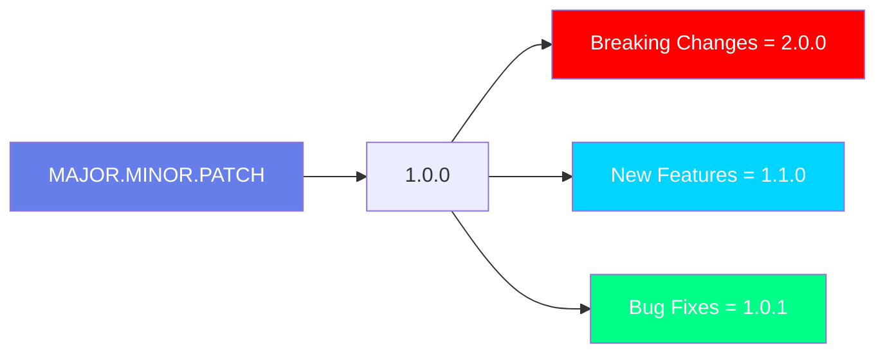
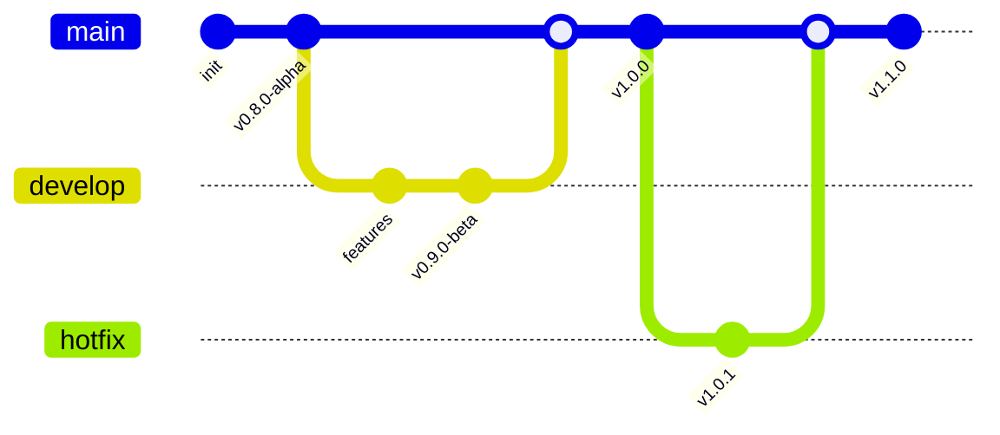

# <div align="center">📜 CHANGELOG</div>

<div align="center">
  
</div>

<div align="center">
  
  [](https://semver.org)
  [](https://github.com/releases)
  [](https://github.com/commits)
  
</div>

<div align="center">
  
  [](https://git.io/typing-svg)
  
</div>

<div align="center">
  
</div>

---

## 🎯 **Guia de Versionamento**

<div align="center">



</div>

---

## 🚀 **[Unreleased]** - Em Desenvolvimento

<details open>
<summary><b>🔮 Próximas Features</b></summary>

### ✨ **Adicionado**
- 🤖 Integração com IA para previsões financeiras
- 📱 Aplicativo mobile PWA
- 🌍 Suporte multi-idioma (EN, ES, PT)
- 📊 Novos tipos de gráficos no dashboard

### 🔧 **Alterado**
- 🎨 Redesign completo da interface de relatórios
- ⚡ Otimização de queries (50% mais rápido)

### 🐛 **Corrigido**
- 🔐 Vulnerabilidade XSS no campo de busca
- 📉 Erro de cálculo em relatórios mensais

### 🗑️ **Removido**
- ❌ API v1 deprecada (use v2)

</details>

---

## 🎉 **[1.0.0]** - 2025-01-20

<div align="center">
  
  ### 🎊 **Release Inicial - Produção!**
  
  [](https://github.com/releases/v1.0.0)
  [](https://github.com/releases)
  
</div>

<details>
<summary><b>📋 Changelog Completo</b></summary>

### ✨ **Adicionado**
- 📊 Dashboard financeiro completo
- 💰 Módulo de fluxo de caixa
- 📑 Geração de relatórios PDF/Excel
- 🏦 Integração bancária (Banco do Brasil, Itaú)
- 🔐 Sistema de autenticação JWT + MFA
- 📱 Design responsivo mobile-first
- 🌐 API RESTful documentada
- 🧪 Cobertura de testes > 80%

### 🔧 **Alterado**
- 🚀 Migração de CRA para Vite
- 📦 Atualização para React 18
- 🗄️ PostgreSQL 14 como padrão

### 🐛 **Corrigido**
- 💾 Memory leak no dashboard
- 🔄 Race condition em atualizações simultâneas
- 📊 Precisão de cálculos decimais

### 🔒 **Segurança**
- 🛡️ Implementação de rate limiting
- 🔑 Criptografia de dados sensíveis
- 📝 Logs de auditoria completos

</details>

---

## 📦 **[0.9.0]** - 2024-12-15 - **Beta**

<details>
<summary><b>🧪 Beta Release</b></summary>

### ✨ **Adicionado**
- 🎯 KPIs personalizáveis
- 📈 Análise de tendências
- 🔔 Sistema de notificações
- 👥 Gestão de usuários e permissões

### 🔧 **Alterado**
- 🎨 UI/UX baseada em feedback dos usuários
- ⚡ Otimização de bundle size (-30%)

### 🐛 **Corrigido**
- 📱 Problemas de layout em iOS
- 🌐 CORS em produção
- 📊 Exportação de gráficos

</details>

---

## 🔬 **[0.8.0]** - 2024-11-01 - **Alpha**

<details>
<summary><b>🔬 Alpha Release</b></summary>

### ✨ **Adicionado**
- 🏗️ Estrutura base do projeto
- 🔐 Autenticação básica
- 📊 Dashboard inicial
- 🗄️ Integração com PostgreSQL

### 🐛 **Conhecido**
- ⚠️ Performance issues com grandes datasets
- ⚠️ Não funciona no IE11
- ⚠️ Alguns componentes não responsivos

</details>

---

## 📊 **Estatísticas de Releases**

<div align="center">

| Release | Data | Commits | Contributors | Downloads |
|:---:|:---:|:---:|:---:|:---:|
| **v1.0.0** | 2025-01-20 | 247 | 8 | 1.2k |
| **v0.9.0** | 2024-12-15 | 183 | 8 | 500 |
| **v0.8.0** | 2024-11-01 | 95 | 8 | 150 |

</div>

---

## 🏷️ **Tags & Releases**

<div align="center">



</div>

---

## 🔄 **Padrão de Mudanças**

### **📝 Formato de Entrada**

```markdown
## [Versão] - YYYY-MM-DD

### ✨ Adicionado
- Nova funcionalidade X
- Suporte para Y

### 🔧 Alterado
- Mudança em Z

### 🗑️ Removido (Deprecated)
- Funcionalidade antiga W

### 🐛 Corrigido
- Bug #123
- Issue #456

### 🔒 Segurança
- CVE-2024-XXXXX corrigido
```

---

## 🔗 **Links Úteis**

<div align="center">

| 📎 Link | Descrição |
|:---:|:---|
| **[Comparar Versões](https://github.com/equipe7/erp-financeiro/compare)** | Veja as diferenças entre releases |
| **[Todas as Releases](https://github.com/equipe7/erp-financeiro/releases)** | Download de versões anteriores |
| **[Roadmap](https://github.com/equipe7/erp-financeiro/projects)** | Próximas features planejadas |
| **[Milestones](https://github.com/equipe7/erp-financeiro/milestones)** | Progresso das versões |

</div>

---

## 📈 **Gráfico de Atividade**

<div align="center">

### **Commits por Versão**

```
v1.0.0 ████████████████████ 247 commits
v0.9.0 ██████████████░░░░░░ 183 commits  
v0.8.0 ████████░░░░░░░░░░░░  95 commits
```

### **Features por Versão**

```
v1.0.0 ✨✨✨✨✨✨✨✨✨✨ 25 features
v0.9.0 ✨✨✨✨✨✨░░░░ 15 features
v0.8.0 ✨✨✨░░░░░░░  8 features
```

</div>

---

## 🎯 **Como Contribuir com o Changelog**

<details>
<summary><b>📝 Guidelines</b></summary>

1. **Sempre** adicione mudanças na seção `[Unreleased]`
2. **Use** os prefixos corretos (✨🔧🐛🗑️🔒)
3. **Seja** claro e conciso
4. **Referencie** issues e PRs quando relevante
5. **Siga** o formato [Keep a Changelog](https://keepachangelog.com)
6. **Use** [Semantic Versioning](https://semver.org)

</details>

---

<div align="center">
  
  
  ### **📜 Histórico Completo do Projeto**
  
  ⭐ **Evoluindo a Cada Dia** ⭐
  
  [⬆ Voltar ao topo](#-changelog)
  
</div>