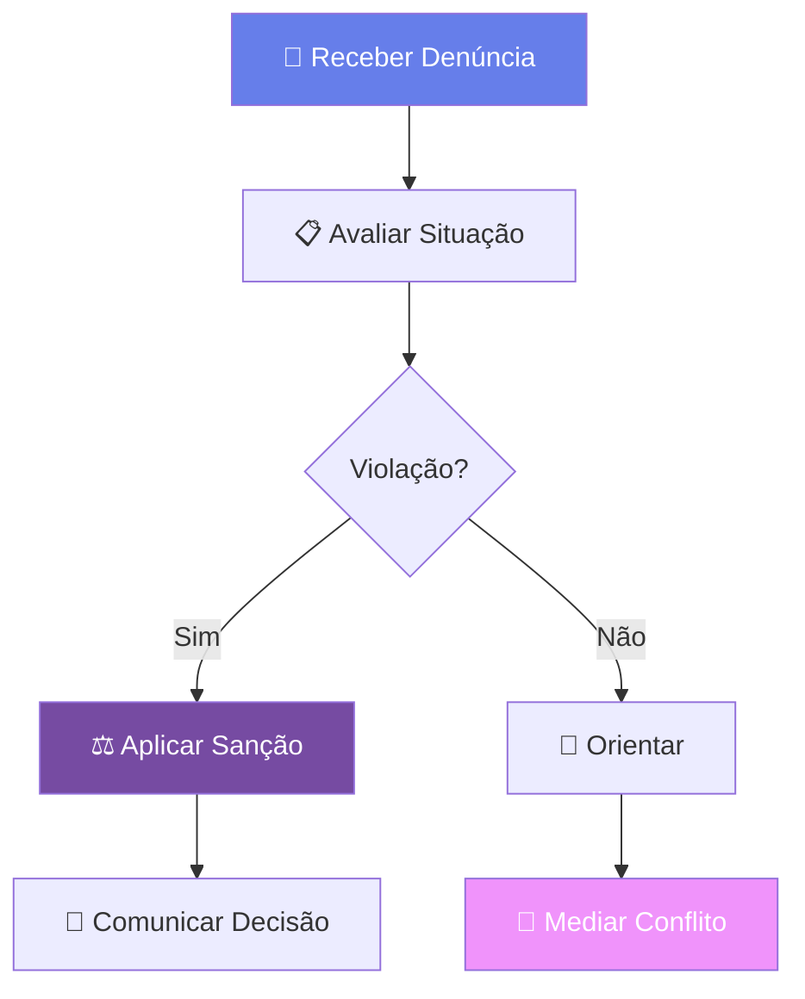

# <div align="center">🤝 CÓDIGO DE CONDUTA</div>

<div align="center">
  
</div>

<div align="center">
  
  [](https://www.contributor-covenant.org/)
  [](https://www.contributor-covenant.org/)
  [](https://www.contributor-covenant.org/)
  
</div>

<div align="center">
  
  [](https://git.io/typing-svg)
  
</div>

---

## 🎯 **Nosso Compromisso**

<div style="background: linear-gradient(135deg, #667eea 0%, #764ba2 100%); padding: 20px; border-radius: 15px; margin: 20px 0;">

Nós, como membros, colaboradores e líderes, nos comprometemos a fazer da participação em nossa comunidade uma experiência **livre de assédio** para todos, independentemente de idade, tamanho corporal, deficiência visível ou invisível, etnia, características sexuais, identidade e expressão de gênero, nível de experiência, educação, status socioeconômico, nacionalidade, aparência pessoal, raça, religião ou identidade e orientação sexual.

</div>

---

## 🌟 **Nossos Valores Fundamentais**

<table align="center">
  <tr>
    <td align="center" width="25%">
      <br>
      <b>💜 Respeito</b><br>
      <sub>Valorize cada pessoa</sub>
    </td>
    <td align="center" width="25%">
      <br>
      <b>🌈 Inclusão</b><br>
      <sub>Acolha a diversidade</sub>
    </td>
    <td align="center" width="25%">
      <br>
      <b>🤝 Colaboração</b><br>
      <sub>Trabalhe em equipe</sub>
    </td>
    <td align="center" width="25%">
      <br>
      <b>⭐ Excelência</b><br>
      <sub>Busque o melhor</sub>
    </td>
  </tr>
</table>

---

## ✅ **Comportamentos Esperados**

<details>
<summary><b>🌟 Exemplos de Comportamento Positivo</b></summary>

### **Profissionalismo**
- ✨ Use linguagem acolhedora e inclusiva
- 🤝 Respeite diferentes pontos de vista e experiências
- 💝 Aceite feedback construtivo com graciosidade
- 🎯 Foque no que é melhor para a comunidade
- 💪 Demonstre empatia com outros membros

### **Colaboração**
- 📚 Compartilhe conhecimento generosamente
- 🤲 Ajude novatos com paciência
- 🎉 Celebre conquistas da equipe
- 🔄 Dê crédito onde é devido
- 💬 Comunique-se de forma clara e respeitosa

### **Crescimento**
- 📈 Apoie o desenvolvimento de outros
- 🌱 Seja mentor quando possível
- 🎓 Aprenda com os erros
- 🚀 Incentive inovação
- ⭐ Reconheça contribuições

</details>

---

## ❌ **Comportamentos Inaceitáveis**

<div align="center">

| 🚫 **Categoria** | **Descrição** | **Consequência** |
|:---:|:---|:---:|
| **🔞 Assédio** | Comentários sexuais, avanços indesejados | **Banimento Imediato** |
| **💢 Insultos** | Ataques pessoais, trolling, comentários depreciativos | **Advertência → Ban** |
| **🎭 Discriminação** | Preconceito de qualquer natureza | **Banimento Imediato** |
| **🔓 Privacidade** | Publicar informações privadas de outros | **Banimento Imediato** |
| **👻 Stalking** | Perseguição online ou offline | **Banimento + Denúncia** |
| **🗣️ Intimidação** | Ameaças ou linguagem violenta | **Banimento Imediato** |

</div>

---

## 🛡️ **Responsabilidades da Liderança**

### **👮 Nossos Moderadores**

<div align="center">



</div>

### **⚖️ Níveis de Resposta**

<table>
  <tr>
    <th>Nível</th>
    <th>Violação</th>
    <th>Ação</th>
    <th>Duração</th>
  </tr>
  <tr>
    <td><b>1️⃣ Orientação</b></td>
    <td>Primeira infração leve</td>
    <td>Conversa privada educativa</td>
    <td>-</td>
  </tr>
  <tr>
    <td><b>2️⃣ Advertência</b></td>
    <td>Comportamento inadequado</td>
    <td>Advertência pública</td>
    <td>Registro permanente</td>
  </tr>
  <tr>
    <td><b>3️⃣ Suspensão</b></td>
    <td>Violação séria ou reincidência</td>
    <td>Suspensão temporária</td>
    <td>7-30 dias</td>
  </tr>
  <tr>
    <td><b>4️⃣ Banimento</b></td>
    <td>Violação grave ou múltiplas infrações</td>
    <td>Banimento permanente</td>
    <td>Indefinido</td>
  </tr>
</table>

---

## 📢 **Como Reportar**

### **🚨 Canais de Denúncia**

<div align="center">

| Canal | Contato | Tempo de Resposta | Confidencial |
|:---:|:---:|:---:|:---:|
| **📧 Email** | conduct@equipe7.com | 24h | ✅ |
| **💬 Discord** | @moderadores | 2h | ⚠️ |
| **🔒 Formulário** | [Link Privado](https://forms.gle) | 48h | ✅ |
| **📱 DM** | Líderes do Projeto | 12h | ✅ |

</div>

### **📝 O que Incluir na Denúncia**

<details>
<summary><b>Informações Necessárias</b></summary>

```markdown
1. **Seu Contato** (pode ser anônimo)
2. **Data e Hora** do incidente
3. **Local** (Issue, PR, Discord, etc)
4. **Pessoas Envolvidas**
5. **Descrição Detalhada** do ocorrido
6. **Screenshots/Links** (se disponível)
7. **Testemunhas** (se houver)
8. **Ação Desejada** (opcional)
```

</details>

---

## 🌍 **Escopo de Aplicação**

### **📍 Onde Este Código se Aplica**

<div align="center">

| ✅ **Aplica-se** | ❌ **Não se Aplica** |
|:---|:---|
| • Repositório GitHub | • Vida pessoal privada |
| • Issues e Pull Requests | • Outras comunidades |
| • Discussões do projeto | • Redes sociais pessoais |
| • Discord oficial | • Conversas não relacionadas |
| • Eventos da equipe | • Opiniões políticas pessoais |
| • Representando o projeto | • Crenças religiosas |

</div>

---

## 🤝 **Atribuição**

<div align="center">

Este Código de Conduta é adaptado do [Contributor Covenant](https://www.contributor-covenant.org), versão 2.1.

[](https://www.contributor-covenant.org/version/2/1/code_of_conduct.html)

</div>

---

## 💬 **FAQ - Perguntas Frequentes**

<details>
<summary><b>❓ O que acontece após uma denúncia?</b></summary>

1. **Recebimento** - Confirmamos em 24h
2. **Investigação** - Analisamos evidências
3. **Decisão** - Equipe decide ação
4. **Comunicação** - Informamos as partes
5. **Ação** - Implementamos a decisão
6. **Follow-up** - Monitoramos situação

</details>

<details>
<summary><b>❓ Posso fazer denúncia anônima?</b></summary>

Sim! Respeitamos denúncias anônimas, mas isso pode limitar nossa capacidade de investigar completamente.

</details>

<details>
<summary><b>❓ E se eu discordar de uma decisão?</b></summary>

Você pode solicitar revisão enviando email para appeals@equipe7.com com justificativa detalhada.

</details>

<details>
<summary><b>❓ Moderadores também estão sujeitos ao código?</b></summary>

Absolutamente! Todos, incluindo liderança, devem seguir este código.

</details>

---

<div align="center">
  
  
  ### **💜 Juntos Somos Mais Fortes**
  
  ⭐ **Respeito • Inclusão • Colaboração** ⭐
  
  [⬆ Voltar ao topo](#-código-de-conduta)
  
</div>