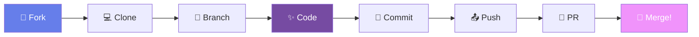

# <div align="center">🤝 CONTRIBUTING GUIDE</div>

<div align="center">
  
</div>

<div align="center">
  
  [](https://github.com/pulls)
  [](https://www.contributor-covenant.org/)
  [](https://github.com/discussions)
  
</div>

<div align="center">
  
  [](https://git.io/typing-svg)
  
</div>

<div align="center">
  
</div>

---

##  **Bem-vindo, Colaborador!**

<div style="background: linear-gradient(135deg, #667eea 0%, #764ba2 100%); padding: 20px; border-radius: 15px; margin: 20px 0;">

Ficamos **MUITO FELIZES** que você quer contribuir com o ERP Financeiro! 🎉

Este documento é seu guia completo para se tornar um colaborador do projeto. Não importa se você é iniciante ou experiente - **toda ajuda é valiosa!**

</div>

---

## 🎯 **Quick Start - Primeira Contribuição**

<div align="center">



</div>

### **🚀 Passo a Passo Rápido**

```bash
# 1️⃣ Fork o projeto (botão no GitHub)

# 2️⃣ Clone seu fork
git clone https://github.com/SEU-USUARIO/erp-financeiro.git
cd erp-financeiro

# 3️⃣ Adicione o upstream
git remote add upstream https://github.com/equipe7/erp-financeiro.git

# 4️⃣ Crie uma branch
git checkout -b feature/minha-feature

# 5️⃣ Faça suas mudanças e commit
git add .
git commit -m "✨ feat: adiciona nova funcionalidade"

# 6️⃣ Push para seu fork
git push origin feature/minha-feature

# 7️⃣ Abra um Pull Request no GitHub! 🎉
```

---

## 📋 **Tipos de Contribuição**

<table align="center">
  <tr>
    <td align="center" width="25%">
      <br>
      <b>💻 Código</b><br>
      <sub>Features & Bugs</sub>
    </td>
    <td align="center" width="25%">
      <br>
      <b>📚 Documentação</b><br>
      <sub>Docs & Tutoriais</sub>
    </td>
    <td align="center" width="25%">
      <br>
      <b>🎨 Design</b><br>
      <sub>UI/UX & Assets</sub>
    </td>
    <td align="center" width="25%">
      <br>
      <b>🧪 Testes</b><br>
      <sub>QA & Testing</sub>
    </td>
  </tr>
</table>

### **🎯 Onde Contribuir**

<details>
<summary><b>🐛 Encontrou um Bug?</b></summary>

1. **Verifique** se já não foi reportado nas [Issues](https://github.com/issues)
2. **Crie uma Issue** com o template de bug
3. **Inclua**:
   - Descrição clara do problema
   - Passos para reproduzir
   - Comportamento esperado vs atual
   - Screenshots (se aplicável)
   - Ambiente (OS, Browser, Node version)

</details>

<details>
<summary><b>✨ Quer Adicionar uma Feature?</b></summary>

1. **Discuta primeiro** - abra uma Issue para discussão
2. **Aguarde aprovação** antes de começar a codar
3. **Siga o roadmap** do projeto
4. **Mantenha o escopo** pequeno e focado
5. **Documente** sua feature

</details>

<details>
<summary><b>📝 Melhorar Documentação?</b></summary>

- Corrigir typos e erros
- Adicionar exemplos
- Melhorar explicações
- Traduzir documentos
- Criar tutoriais
- Adicionar diagramas

</details>

<details>
<summary><b>🎨 Contribuir com Design?</b></summary>

- Melhorar UI/UX
- Criar mockups
- Desenvolver componentes
- Otimizar responsividade
- Criar assets visuais
- Melhorar acessibilidade

</details>

---

## 📝 **Padrões de Código**

### **🎨 Style Guide**

<div align="center">

| Linguagem | Style Guide | Linter |
|:---:|:---:|:---:|
| **JavaScript** | [Airbnb](https://github.com/airbnb/javascript) | ESLint |
| **React** | [Hooks & Functional](https://react.dev/) | ESLint |
| **CSS** | [BEM Methodology](http://getbem.com/) | Stylelint |
| **Node.js** | [Standard](https://standardjs.com/) | ESLint |

</div>

### **📏 Regras Gerais**

```javascript
// ✅ BOM
const calculateTotal = (items) => {
  return items.reduce((sum, item) => sum + item.price, 0);
};

// ❌ RUIM
function calc(i) {
  let s = 0;
  for(let x = 0; x < i.length; x++) s += i[x].price;
  return s;
}
```

### **🏗️ Estrutura de Componentes React**

```jsx
// ✅ Estrutura Recomendada
import React, { useState, useEffect } from 'react';
import PropTypes from 'prop-types';
import styles from './Component.module.css';

const Component = ({ title, onAction }) => {
  const [state, setState] = useState(null);
  
  useEffect(() => {
    // Side effects
  }, []);
  
  return (
    <div className={styles.container}>
      <h2>{title}</h2>
      {/* Component content */}
    </div>
  );
};

Component.propTypes = {
  title: PropTypes.string.isRequired,
  onAction: PropTypes.func
};

export default Component;
```

---

## 💬 **Padrões de Commit**

### **📐 Formato**

```
<tipo>(<escopo>): <mensagem>

[corpo opcional]

[rodapé opcional]
```

### **🏷️ Tipos de Commit**

<div align="center">

| Tipo | Emoji | Quando Usar |
|:---:|:---:|:---|
| **feat** | ✨ | Nova funcionalidade |
| **fix** | 🐛 | Correção de bug |
| **docs** | 📚 | Apenas documentação |
| **style** | 💎 | Formatação (não afeta lógica) |
| **refactor** | ♻️ | Refatoração de código |
| **perf** | 🚀 | Melhoria de performance |
| **test** | 🧪 | Adição ou correção de testes |
| **build** | 📦 | Build system ou dependências |
| **ci** | 👷 | Configuração de CI |
| **chore** | 🔧 | Outras mudanças |
| **revert** | ⏪ | Reverter commit anterior |

</div>

### **✅ Exemplos de Bons Commits**

```bash
✨ feat(dashboard): adiciona gráfico de receitas mensais

🐛 fix(auth): corrige erro de token expirado

📚 docs(readme): atualiza instruções de instalação

♻️ refactor(api): melhora estrutura de rotas

🚀 perf(query): otimiza consulta de relatórios

🧪 test(payment): adiciona testes para módulo de pagamento
```

---

## 🔄 **Processo de Pull Request**

### **📋 Checklist do PR**

```markdown
## Descrição
Breve descrição das mudanças

## Tipo de Mudança
- [ ] 🐛 Bug fix
- [ ] ✨ Nova feature
- [ ] 💔 Breaking change
- [ ] 📚 Documentação

## Checklist
- [ ] Código segue o style guide
- [ ] Self-review realizado
- [ ] Comentários em código complexo
- [ ] Documentação atualizada
- [ ] Sem warnings no console
- [ ] Testes adicionados
- [ ] Testes passando
- [ ] Título do PR segue convenção
```

### **🎯 Dicas para um PR Perfeito**

<table>
  <tr>
    <td>✅ <b>FAÇA</b></td>
    <td>❌ <b>NÃO FAÇA</b></td>
  </tr>
  <tr>
    <td>
      • PRs pequenos e focados<br>
      • Descrição clara e detalhada<br>
      • Screenshots quando visual<br>
      • Referencie issues relacionadas<br>
      • Responda reviews rapidamente<br>
      • Teste antes de submeter
    </td>
    <td>
      • PRs gigantes com múltiplas features<br>
      • Commits com mensagens vagas<br>
      • Ignorar feedback de revisores<br>
      • Quebrar testes existentes<br>
      • Misturar formatação com lógica<br>
      • Fazer force push após review
    </td>
  </tr>
</table>

---

## 🧪 **Rodando Testes**

### **🚀 Comandos de Teste**

```bash
# Instalar dependências
npm install

# Rodar todos os testes
npm test

# Testes com coverage
npm run test:coverage

# Testes em watch mode
npm run test:watch

# Testes específicos
npm test -- --grep "Dashboard"

# Linting
npm run lint

# Formatar código
npm run format
```

### **📊 Requisitos de Cobertura**

<div align="center">

| Tipo | Mínimo | Ideal |
|:---:|:---:|:---:|
| **Statements** | 70% | 85%+ |
| **Branches** | 65% | 80%+ |
| **Functions** | 70% | 85%+ |
| **Lines** | 70% | 85%+ |

</div>

---

## 🏗️ **Configurando Ambiente**

### **📋 Pré-requisitos**

<div align="center">

| Ferramenta | Versão | Obrigatório |
|:---:|:---:|:---:|
| **Node.js** | 18.x+ | ✅ |
| **PostgreSQL** | 14+ | ✅ |
| **Git** | 2.x+ | ✅ |
| **Docker** | 20+ | ⭕ |
| **VS Code** | Latest | ⭕ |

</div>

### **⚙️ Setup Completo**

<details>
<summary><b>Ver instruções detalhadas</b></summary>

```bash
# 1. Clone o repositório
git clone https://github.com/equipe7/erp-financeiro.git
cd erp-financeiro

# 2. Configure variáveis de ambiente
cp .env.example .env.local
# Edite .env.local com suas configurações

# 3. Instale dependências
npm install

# 4. Configure o banco de dados
npm run db:setup
npm run db:migrate
npm run db:seed

# 5. Inicie os serviços
npm run dev

# 6. Acesse a aplicação
# Frontend: http://localhost:3000
# Backend: http://localhost:3333
# Docs: http://localhost:3333/api-docs
```

</details>

---

## 📚 **Recursos Úteis**

### **📖 Documentação**

<div align="center">

| 📚 Recurso | 🔗 Link |
|:---:|:---|
| **React Docs** | [react.dev](https://react.dev) |
| **Node.js Guide** | [nodejs.org](https://nodejs.org) |
| **PostgreSQL Docs** | [postgresql.org](https://postgresql.org) |
| **Git Tutorial** | [git-scm.com](https://git-scm.com) |
| **Jest Testing** | [jestjs.io](https://jestjs.io) |
| **ESLint Rules** | [eslint.org](https://eslint.org) |

</div>

### **🎓 Tutorials Recomendados**

- 🎯 [Como fazer seu primeiro Pull Request](https://www.firsttimersonly.com/)
- 📚 [Entendendo Git Flow](https://www.atlassian.com/git/tutorials/comparing-workflows/gitflow-workflow)
- ✨ [Clean Code JavaScript](https://github.com/ryanmcdermott/clean-code-javascript)
- 🧪 [Testing Best Practices](https://github.com/goldbergyoni/javascript-testing-best-practices)

---

## 🤔 **Dúvidas Frequentes**

<details>
<summary><b>❓ Como atualizar meu fork?</b></summary>

```bash
git fetch upstream
git checkout main
git merge upstream/main
git push origin main
```

</details>

<details>
<summary><b>❓ Como desfazer um commit?</b></summary>

```bash
# Desfazer último commit (mantém mudanças)
git reset --soft HEAD~1

# Desfazer último commit (descarta mudanças)
git reset --hard HEAD~1
```

</details>

<details>
<summary><b>❓ Como resolver conflitos?</b></summary>

```bash
# Atualize sua branch
git fetch upstream
git rebase upstream/main

# Resolva conflitos manualmente
# Depois continue o rebase
git rebase --continue
```

</details>

<details>
<summary><b>❓ Meu PR foi rejeitado, e agora?</b></summary>

- Não desanime! 💪
- Leia o feedback com atenção
- Faça as correções sugeridas
- Pergunte se tiver dúvidas
- Aprenda com a experiência

</details>

---

## 👥 **Código de Conduta**

### **🌟 Nossos Valores**

<div align="center">

| 💜 **Respeito** | 🤝 **Colaboração** | 🌈 **Inclusão** | 🚀 **Excelência** |
|:---:|:---:|:---:|:---:|
| Trate todos com respeito | Trabalhe em equipe | Acolha diversidade | Busque qualidade |

</div>

### **✅ Comportamento Esperado**

- 🤝 Seja respeitoso e profissional
- 💭 Aceite feedback construtivo
- 🎯 Foque no que é melhor para o projeto
- 👥 Ajude outros contribuidores
- 📚 Compartilhe conhecimento

### **❌ Comportamento Inaceitável**

- 🚫 Linguagem ofensiva ou discriminatória
- ⛔ Assédio de qualquer tipo
- 🔒 Publicar informações privadas
- 💢 Ataques pessoais
- 🚨 Conduta antiética

---

## 🎉 **Hall da Fama - Top Contributors**

<div align="center">

Obrigado a todos que contribuíram! ⭐

<!-- ALL-CONTRIBUTORS-LIST:START -->
<table>
  <tr>
    <td align="center">
      <br />
      <sub><b>Você pode ser o primeiro!</b></sub>
    </td>
    <td align="center">
      <br />
      <sub><b>Aguardando...</b></sub>
    </td>
    <td align="center">
      <br />
      <sub><b>Aguardando...</b></sub>
    </td>
    <td align="center">
      <br />
      <sub><b>Aguardando...</b></sub>
    </td>
  </tr>
</table>
<!-- ALL-CONTRIBUTORS-LIST:END -->

</div>

---

## 📞 **Precisa de Ajuda?**

<div align="center">

| 💬 Canal | 🔗 Link | ⏰ Resposta |
|:---:|:---:|:---:|
| **GitHub Issues** | [Criar Issue](https://github.com/issues) | 24-48h |
| **Discussions** | [Fórum](https://github.com/discussions) | 12-24h |
| **Discord** | [Servidor](https://discord.gg) | Real-time |
| **Email** | equipe7@erp.com | 48-72h |

</div>

---

<div align="center">
  
  
  ### **💜 Obrigado por Contribuir!**
  
  ⭐ **Não esqueça de dar uma estrela no projeto!** ⭐
  
  [⬆ Voltar ao topo](#-contributing-guide)
  
</div>