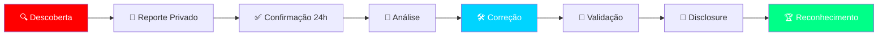
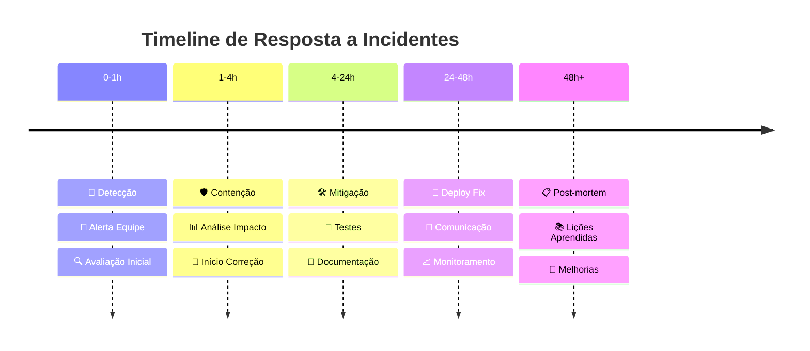

# <div align="center">🔐 POLÍTICA DE SEGURANÇA</div>

<div align="center">
  
</div>

<div align="center">
  
  [](https://github.com/security)
  [](https://cve.mitre.org/)
  [](https://github.com/security)
  
</div>

<div align="center">
  
  [](https://git.io/typing-svg)
  
</div>

<div align="center">
  
</div>

---

## 🎯 **Versões Suportadas**

<div align="center">

| Versão | Suportada | Status | Fim do Suporte |
|:---:|:---:|:---:|:---:|
| **1.0.x** | ✅ | **LTS** | Dezembro 2026 |
| **0.9.x** | ⚠️ | Manutenção | Junho 2025 |
| **0.8.x** | ❌ | Descontinuado | Janeiro 2025 |
| **< 0.8** | ❌ | Fim de Vida | - |

</div>

---

## 🚨 **Reportando Vulnerabilidades**

### **📊 Níveis de Severidade**

<div align="center">

| Nível | Severidade | Exemplos | SLA | Bounty |
|:---:|:---:|:---|:---:|:---:|
| **🔴 P0** | **Crítica** | RCE, SQL Injection, Auth Bypass | 24h | 💰 $500-1000 |
| **🟠 P1** | **Alta** | XSS Stored, Privilege Escalation | 48h | 💰 $200-500 |
| **🟡 P2** | **Média** | CSRF, Information Disclosure | 7 dias | 💰 $50-200 |
| **🟢 P3** | **Baixa** | XSS Reflected, Missing Headers | 30 dias | 🏆 Hall of Fame |

</div>

### **🔒 Processo de Reporte Seguro**

<div align="center">



</div>

### **📧 Como Reportar**

<details>
<summary><b>🔐 Reporte Privado (Recomendado)</b></summary>

```markdown
Para: security@equipe7.com
Assunto: [SECURITY] Vulnerabilidade em [componente]

## Informações do Reporte

**Pesquisador:** Seu Nome
**Data:** DD/MM/YYYY
**Severidade:** Crítica/Alta/Média/Baixa

## Descrição
[Descrição clara da vulnerabilidade]

## Impacto
[Possíveis consequências]

## Passos para Reproduzir
1. Passo 1
2. Passo 2
3. Passo 3

## Prova de Conceito
[Código ou screenshots]

## Solução Sugerida
[Se tiver sugestão de correção]

## Referências
[CVEs relacionados, links]
```

</details>

<details>
<summary><b>⚠️ GitHub Security Advisory</b></summary>

1. Navegue até **Security** → **Advisories**
2. Clique em **New draft security advisory**
3. Preencha todos os campos
4. Submeta para análise

</details>

---

## 🛡️ **Medidas de Segurança Implementadas**

### **🔐 Camadas de Proteção**

<table align="center">
  <tr>
    <td align="center" width="25%">
      <br>
      <b>🔑 Autenticação</b><br>
      <sub>JWT + MFA</sub>
    </td>
    <td align="center" width="25%">
      <br>
      <b>🔒 Criptografia</b><br>
      <sub>AES-256 + TLS 1.3</sub>
    </td>
    <td align="center" width="25%">
      <br>
      <b>🛡️ WAF</b><br>
      <sub>Cloudflare Protection</sub>
    </td>
    <td align="center" width="25%">
      <br>
      <b>📝 Auditoria</b><br>
      <sub>Logs Completos</sub>
    </td>
  </tr>
</table>

### **⚡ Headers de Segurança**

```nginx
# Security Headers Implementados
X-Content-Type-Options: nosniff
X-Frame-Options: DENY
X-XSS-Protection: 1; mode=block
Content-Security-Policy: default-src 'self'
Strict-Transport-Security: max-age=31536000; includeSubDomains
Referrer-Policy: strict-origin-when-cross-origin
Permissions-Policy: geolocation=(), microphone=(), camera=()
```

---

## 🔍 **Checklist de Segurança**

### **✅ Para Desenvolvedores**

<details>
<summary><b>📝 Antes de Cada Commit</b></summary>

- [ ] **Sem credenciais** hardcoded
- [ ] **Sem informações** sensíveis em logs
- [ ] **Validação de input** implementada
- [ ] **Sanitização de output** aplicada
- [ ] **Dependências** atualizadas
- [ ] **Testes de segurança** passando
- [ ] **Code review** realizado
- [ ] **SAST scan** executado

</details>

<details>
<summary><b>🚀 Antes do Deploy</b></summary>

- [ ] **Audit npm/yarn** sem vulnerabilidades críticas
- [ **.env** configurado corretamente
- [ ] **CORS** configurado restritivamente
- [ ] **Rate limiting** ativado
- [ ] **Backup** testado
- [ ] **Rollback** preparado
- [ ] **Monitoramento** configurado
- [ ] **Penetration test** realizado

</details>

---

## 📊 **Monitoramento de Segurança**

### **🔔 Ferramentas Utilizadas**

<div align="center">

| Ferramenta | Função | Status | Frequência |
|:---:|:---|:---:|:---:|
| **🤖 Dependabot** | Atualização de dependências | ✅ Ativo | Diário |
| **🔍 CodeQL** | Análise estática | ✅ Ativo | Por commit |
| **🛡️ Snyk** | Vulnerability scanning | ✅ Ativo | Contínuo |
| **📊 OWASP ZAP** | Penetration testing | ⚠️ Manual | Mensal |
| **🔐 GitHub Security** | Secret scanning | ✅ Ativo | Real-time |

</div>

---

## 🚀 **Resposta a Incidentes**

### **🎯 Plano de Resposta**

<div align="center">



</div>

### **📞 Contatos de Emergência**

<div align="center">

| Função | Contato | Disponibilidade |
|:---:|:---:|:---:|
| **🚨 Security Lead** | security@equipe7.com | 24/7 |
| **👨‍💻 Tech Lead** | tech@equipe7.com | Business hours |
| **🔧 DevOps** | devops@equipe7.com | On-call |
| **📢 Comunicação** | pr@equipe7.com | Business hours |

</div>

---

## 🏆 **Hall of Fame - Security Researchers**

<div align="center">

Agradecemos aos pesquisadores que ajudaram a tornar nosso sistema mais seguro!

| 🥇 **Gold** | 🥈 **Silver** | 🥉 **Bronze** |
|:---:|:---:|:---:|
| *Aguardando heróis* | *Seja o primeiro!* | *Reporte bugs!* |

</div>

---

## 📚 **Recursos de Segurança**

### **📖 Documentação Recomendada**

<div align="center">

| Recurso | Link | Tipo |
|:---:|:---|:---:|
| **OWASP Top 10** | [owasp.org/top10](https://owasp.org/Top10/) | 📚 Guide |
| **CWE Top 25** | [cwe.mitre.org](https://cwe.mitre.org/top25/) | 📊 Lista |
| **NIST Framework** | [nist.gov](https://www.nist.gov/cyberframework) | 🛡️ Framework |
| **Security Headers** | [securityheaders.com](https://securityheaders.com) | 🔧 Tool |
| **SSL Labs** | [ssllabs.com](https://www.ssllabs.com) | 🔐 Test |

</div>

---

## ⚖️ **Compliance & Certificações**

<div align="center">

| Certificação | Status | Validade | Próxima Auditoria |
|:---:|:---:|:---:|:---:|
| **🔐 SOC 2** | 🚧 Em Progresso | - | Q3 2025 |
| **🛡️ ISO 27001** | 📋 Planejado | - | Q4 2025 |
| **📊 LGPD** | ✅ Compliant | 2025 | Q2 2025 |
| **🔒 PCI DSS** | 📋 Planejado | - | Q1 2026 |

</div>

---

<div align="center">
  
  
  ### **🔐 Segurança é Responsabilidade de Todos**
  
  ⭐ **Reporte • Proteja • Colabore** ⭐
  
  [⬆ Voltar ao topo](#-política-de-segurança)
  
</div>